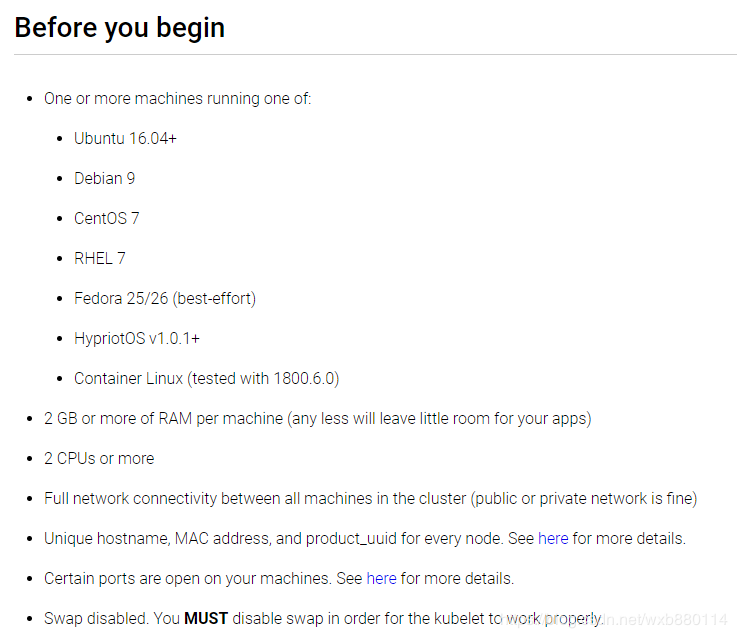

# k8s 学习记录
  
 
 1. introduction 

 + MESOS APACHE 分布式资源管理框架 2019-05 -> Kubernetes 
 + Docker Swarm被剔除阿里云选项 
 + Kubernetes Google 10年容器化基础框架 Go语言   (k8s ~= Borg 开源)
    + 轻量
    + 开源
    + 弹性收缩 
    + 负载均衡: IPVS

2. 前世今生 框架 关键字含义
 + API server 所有组件访问的统一入口
 + controller manager:维持副本期望数目
 + Scheduler 负责介绍任务，选择合适的节点分配任务
 + ETCD 键值对数据库，存储k8s集群重要信息 持久化
  

 + Kubelet 直接跟容器引擎交互实现容器的生命周期管理。
 + Kube proxy操作防火墙实现Pod的映射，负责写入规则至IPTABLES/IPVS实现服务映射访问目的
 + dashboard 给k8s集群提供一个BS结构访问体系
 + ingress controller 官方只能实现四层代理，ingress实现7层代理
 + Federation 提供一个可以跨集群中心多k8s统一管理功能
 + promethemus: 提供k8s集群监控能力
 + ELK 提供k8s集群日志统一分析介入平台

3. Pod概念 控制器类型
 * 自主式Pod
 * 控制器管理的Pod
  
    * Replication Controller 确保容器应用的副本树木保持造用户定义的副本数
    * ReplicaSet 和RC无本质区别，支持集合式的selector， 
    可以滚动更新 回滚
    * 一般建议使用Deployment自动管理ReplicaSet，无需担心其他机制的不兼容问题
        * Horizontal Pod Autoscaling 仅适用于Deployment and ReplicaSet, 实现弹性收缩
    * StatefulSet 为了解决有状态服务的问题，其应用包括稳定持久化存储，稳定网络标志，有序部署，有序收缩，有序删除
    * DaemonSet 确保全部或一些Node 上运行一个Pod的副本
    * Job Cronjob 负责处理任务，即仅执行一次的任务，保证批处理任务的一个或多个Pod成功结束。
 
4. 网络通讯模式
 + k8s的网络模型假定了所有Pod都在一个可以直接连通的扁平的网络空间中，直接到达是Pod认为的，
 + 对于同一个Pod内的容器共享一个Pause，通过localhost即可直接访问，

5. 构建K8S集群

6. 资源清单 语法、编写pod、生命周期

7. Pod控制器

8. 服务发现: SVC
 >- 服务分类
 >   - 有状态服务 DBMS
 >   - 无状态服务 LVS APACHE(数据通过共享服务)

 9. 存储 多种存储类型的特点，并且能在不同环境中选择不同的方案

 10. 调度器 原理，根据要求把Pod定义到想要的节点运行

 11. 集群安全机制 访问控制、原理及流程

 12. HELM: Linux yum 掌握原理 模板自定义

 13. 运维 修改K8s可用期限

 # official
 [link](https://kubernetes.io/docs/tutorials/)

# 安装
 [安装注意事项](https://www.jianshu.com/p/5810c847b7d5)

 [kubernetes构建微服务-k8s安装篇](https://blog.csdn.net/weixin_39686421/article/details/80333015)

 [搭建k8s集群完整篇](https://www.jianshu.com/p/f4ac7f4555d3)
 - 安装要求
   + 一台或多台机器，操作系统 CentOS7.x-86_x64
   + 硬件配置：2GB或更多RAM，2个CPU或更多CPU，硬盘30GB或更多
   + 集群中所有机器之间网络互通
   + 可以访问外网，需要拉取镜像
   + 禁止swap分区

[墙内kubernetes v1.15 体验--2:kubernetes部署](https://www.jianshu.com/p/abb52ae20edd)

1. 本地环境

        macOS 10.14版本；
        CPU： 1.4G节能版i5；
        内存：16GB；
        磁盘：500GB SSD；
2. 构建依赖

        虚拟机：virtualbox 6.0.10；
        VirtualBox 下载地址
        操作系统：Ubuntu Server 16.04 LTS;
        Ubuntu 下载地址
        docker: 19.03.1;
        kubernetes： v1.15.0；

[墙内安装kubernetes教程](https://ieevee.com/tech/2018/09/01/kubeadm.html)

+ 准备工作
    + 更换apt源为163
    + 安装docker
    + 增加kubernetes aliyun镜像源
    + 安装kubeadm/kubelet/kubectl
    + 关闭swap
    + 配置docker mirror
    + 拉取k8s的包并tag
+ 开始安装master
+ 部署weave网络
+ 准备计算资源
+ 安装weave scope
